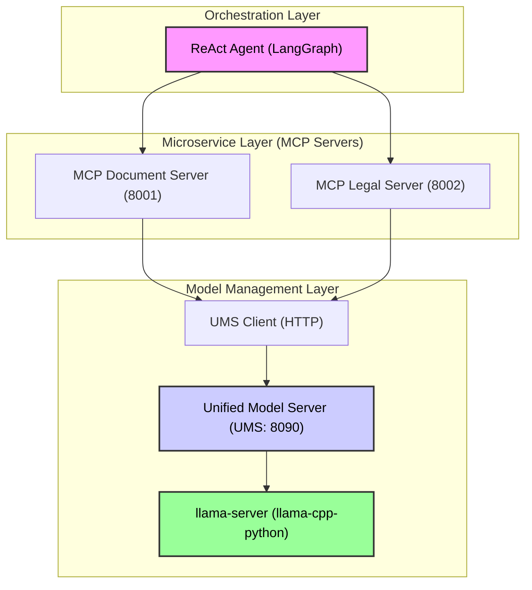

# ReAct Agent Prototype: Microservice Architecture for Document Analysis

Этот прототип демонстрирует переход от монолитной архитектуры к микросервисной для агентной системы обработки документов. Он реализует концепцию **Unified Model Server (UMS)** для эффективного управления ресурсами на одной машине.

Проект использует **LangGraph** для оркестрации, **FastAPI** для создания независимых сервисов (MCP-серверов) и **llama-cpp-python** для инференса локальных моделей.

## Архитектура



### Ключевые компоненты

| Компонент | Файл | Роль |
| :--- | :--- | :--- |
| **ReAct Agent** | `react_agent_http.py` | Главный оркестратор (LangGraph). Делает HTTP-запросы к MCP-серверам. |
| **Document Server** | `mcp_document_server.py` | Сервис для работы с документами (загрузка, чанкинг, OCR). |
| **Legal Server** | `mcp_legal_server.py` | Сервис для юридического анализа (сравнение, анализ изменений). |
| **UMS Client** | `ums_client.py` | HTTP-клиент для UMS. Предоставляет функции `generate_text`, `get_embeddings` и `process_vision`. |
| **Unified Model Server (UMS)** | `unified_model_server.py` | **Реализованный прототип.** Динамически управляет `llama-server` для загрузки/выгрузки моделей (Qwen, LaBSE) и оптимизации VRAM. |

## Особенности реализации

1.  **Динамическое управление моделями (UMS):** UMS запускает `llama-server` в отдельном процессе, загружая модель только по требованию. Это позволяет избежать конфликтов VRAM и максимизировать скорость инференса.
2.  **Адаптивная оптимизация:** UMS поддерживает режимы **GPU**, **CPU** и **Hybrid** (`--n_gpu_layers`) для адаптации к доступному оборудованию (например, RTX 3060 + 32GB RAM).
3.  **Инструменты для Агента:** MCP-серверы реализованы как **внешние инструменты** для ReAct-агента, что соответствует принципу разделения ответственности и масштабируемости.

## Установка

Для запуска прототипа вам потребуется:
1.  Установить Python 3.11+.
2.  Установить зависимости, включая `llama-cpp-python[server]`.
3.  Разместить GGUF-файлы моделей.

```bash
# 1. Перейти в директорию прототипа
cd react_agent_prototype

# 2. Создать виртуальное окружение
python3.11 -m venv venv
source venv/bin/activate

# 3. Установить зависимости
# ВНИМАНИЕ: Для llama-cpp-python может потребоваться установка build-essential и cmake
pip install -r requirements.txt
```

## Запуск и Тестирование

### Вариант 1: Запуск с тестом системы (рекомендуется)

```bash
python3.11 test_system.py
```

Этот скрипт автоматически запускает UMS, MCP-серверы в фоне, выполняет ReAct-агент и завершает все процессы.

### Вариант 2: Ручной запуск всех компонентов

Используйте `run_all.sh` для запуска всех компонентов в отдельных окнах `tmux`.

```bash
./run_all.sh
```

## Структура Прототипа

```
	.
	├── README.md
	├── requirements.txt
	├── .gitignore
	├── run_all.sh
	├── test_system.py
	├── orchestrator/
	│   └── react_agent_http.py        # ReAct Agent (LangGraph)
	├── services/
	│   ├── document_server/
	│   │   └── mcp_document_server.py # MCP Document Server (FastAPI)
	│   ├── legal_server/
	│   │   └── mcp_legal_server.py    # MCP Legal Server (FastAPI)
	│   └── model_manager/
	│       ├── unified_model_server.py# Unified Model Server (UMS) - Реальная логика
	│       ├── ums_client.py          # UMS HTTP-клиент
	│       └── models_config.py       # Конфигурация моделей
	└── REQUIREMENTS_ANALYSIS.md
	```}],path:

## Следующие шаги

1.  **Интеграция RAG:** Добавление RAG-системы в Document Server для более точного контекста.
2.  **Оптимизация чанкинга:** Реализация "умного" разбиения документов на чанки (`smart_chunk`) с учётом семантики и структуры документа.
3.  **Переход на vLLM:** Модификация UMS для поддержки vLLM для моделей с большим контекстом (32K+ токенов), как описано в `ЗадачаподLLM.txt`.
